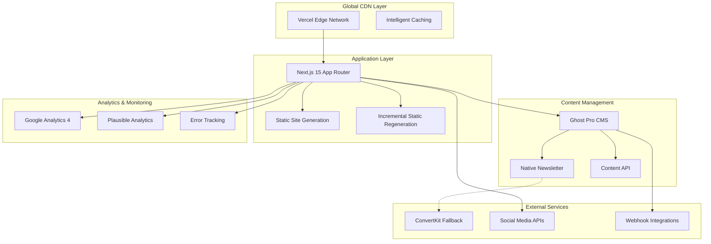
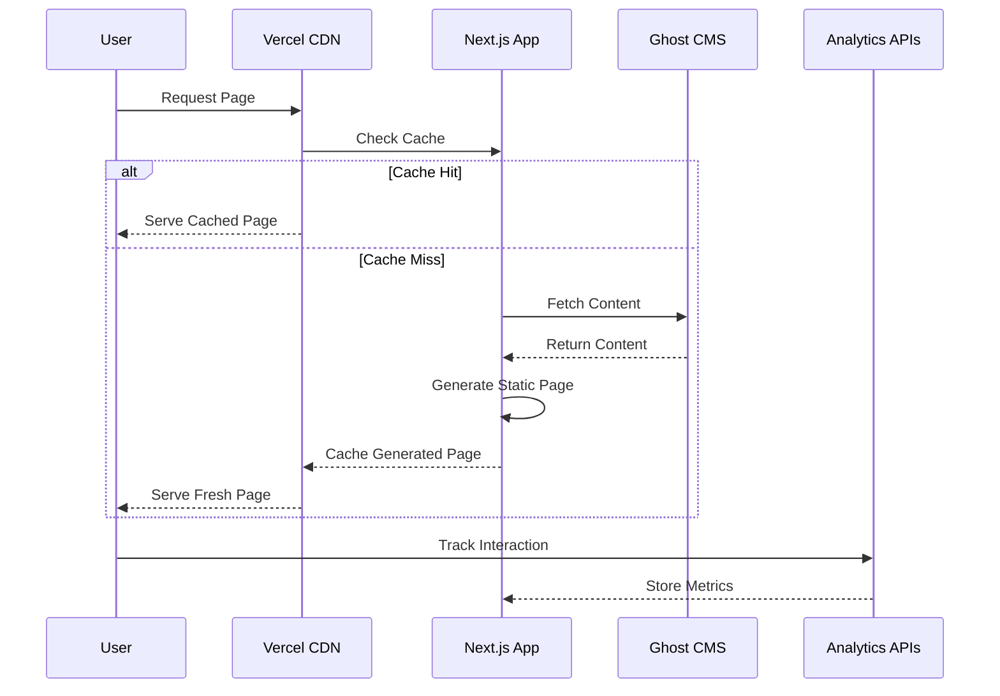
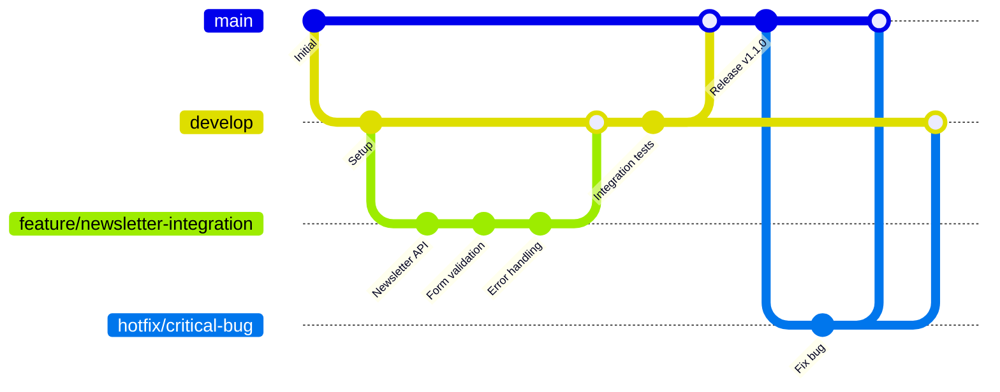

# ARTOfficial Intelligence Academy

> **Transform AI information overload into actionable intelligence**

A premium blog and newsletter platform designed for AI professionals who need curated, credible, and practical insights in an era of information overload. Built with performance, scalability, and authority in mind.


---

## 📋 Table of Contents

- [Overview](#-overview)
- [Features](#-features)
- [System Architecture](#-system-architecture)
- [Technology Stack](#-technology-stack)
- [Quick Start](#-quick-start)
- [Installation Guide](#-installation-guide)
- [Configuration](#-configuration)
- [Usage Examples](#-usage-examples)
- [API Documentation](#-api-documentation)
- [Performance & Monitoring](#-performance--monitoring)
- [Project Structure](#-project-structure)
- [Development Workflow](#-development-workflow)
- [Contributing](#-contributing)
- [License](#-license)
- [Support](#-support)

---

## 🎯 Overview

ARTOfficial Intelligence Academy addresses the critical information overload crisis facing AI professionals. With 70+ AI research papers published daily and overwhelming noise in the market, our platform provides:

### Core Value Proposition
- **Signal in the Noise**: Expert-curated content that cuts through information overload
- **Credibility First**: Verified authors and rigorous source validation  
- **Practical Focus**: Every article includes actionable insights beyond theoretical discussion
- **Quality Over Quantity**: 3-4 deeply researched articles weekly vs. daily surface-level updates

### Business Objectives
- 🎯 **25,000 newsletter subscribers** within 12 months
- 📈 **35%+ newsletter open rate** (vs. 21-25% industry average)
- 🌐 **100,000 monthly unique visitors** by Month 12
- ⚡ **Sub-2-second page loads** globally (95th percentile)

### Market Context
- **AI Education Market**: $5.18B growing at 36% CAGR to $7.05B in 2025
- **Information Overload**: 70+ AI research papers published daily
- **Credibility Crisis**: 83% of professionals struggle to distinguish authoritative sources
- **Application Gap**: Abundant theoretical content lacks practical implementation guidance

---

## ✨ Features

### Content Management System
- 📝 **Rich Text Editor** with Ghost Pro integration and markdown support
- 👥 **Author Profile System** with credibility verification and social integration
- 🏷️ **Content Organization** through categories, tags, and advanced SEO optimization
- 📅 **Editorial Workflow** with draft, review, scheduled publishing, and webhook automation

### Newsletter Platform
- 📧 **Integrated Newsletter System** with Ghost native newsletter (primary) and ConvertKit fallback
- 🎯 **Advanced Segmentation** based on user preferences, behavior, and engagement patterns
- 📊 **A/B Testing Framework** for subject lines, content optimization, and conversion testing
- 🔄 **Automation Sequences** for welcome series, content delivery, and re-engagement campaigns

### User Experience
- 📱 **Mobile-First Design** with responsive layouts across all devices (95+ Lighthouse mobile score)
- 🔍 **Intelligent Search** with full-text search, content recommendations, and semantic filtering
- 🚀 **Performance Optimized** with CDN delivery, image optimization, and sub-2s page loads
- ♿ **Accessibility Compliant** with WCAG 2.1 AA standards and 95+ Lighthouse accessibility score

### Analytics & Business Intelligence
- 📈 **Dual Analytics Strategy** (Google Analytics 4 + Plausible for privacy compliance)
- 📊 **Business Intelligence Dashboard** with KPI tracking and conversion funnel analysis
- 🎯 **Conversion Optimization** with engagement metrics, A/B test results, and user journey mapping
- 📋 **Automated Reporting** with subscriber growth, content performance, and business metrics

---

## 🏗 System Architecture

Our JAMstack architecture is designed for performance, scalability, and maintainability:



### Architecture Decision Records (ADRs)

Key architectural decisions documented in our ADR system:

- **ADR-001**: JAMstack with Next.js 15 App Router for optimal performance
- **ADR-002**: Ghost Pro as primary CMS with ConvertKit fallback strategy
- **ADR-003**: Vercel hosting with global CDN for sub-2s page loads
- **ADR-004**: Dual analytics approach (GA4 + Plausible) for comprehensive insights
- **ADR-005**: TypeScript strict mode with comprehensive type safety
- **ADR-006**: Security-first approach with GDPR compliance and data protection

### Performance Architecture



### Quality Attributes Implementation

| Quality | Target | Implementation |
|---------|--------|----------------|
| **Performance** | LCP ≤ 2.0s (p95) | Static generation, CDN, image optimization |
| **Scalability** | 100k monthly users | Serverless architecture, edge caching |
| **Reliability** | 99.9% uptime | Circuit breakers, fallback systems |
| **Security** | GDPR compliant | Data minimization, encryption, audit trails |
| **Accessibility** | WCAG 2.1 AA | Semantic HTML, keyboard navigation, screen readers |

---

## 🛠 Technology Stack

### Frontend Architecture
- **Next.js 15** - React framework with App Router, SSG/ISR, and performance optimizations
- **TypeScript 5.x** - Type-safe development with strict mode and comprehensive interfaces
- **Tailwind CSS** - Utility-first CSS framework with responsive design and dark mode
- **React 18** - Latest React features with concurrent rendering and Suspense

### Backend & Services
- **Ghost Pro** - Headless CMS for content management and native newsletter functionality
- **ConvertKit** - Advanced newsletter automation and segmentation (fallback option)
- **Vercel** - Serverless hosting with global CDN and automatic scaling
- **MySQL** - Database managed by Ghost Pro with automated backups

### Developer Experience
- **ESLint + Prettier** - Code formatting and quality assurance
- **Husky + lint-staged** - Pre-commit hooks for quality gates
- **Jest + React Testing Library** - Unit and integration testing (90%+ coverage target)
- **Cypress** - End-to-end testing for critical user journeys
- **Lighthouse CI** - Automated performance monitoring and validation

### Analytics & Monitoring
- **Google Analytics 4** - Comprehensive behavior tracking and conversion analysis
- **Plausible Analytics** - Privacy-focused analytics with GDPR compliance
- **Sentry** - Error tracking, performance monitoring, and real-time alerts
- **Vercel Analytics** - Core Web Vitals monitoring and real user metrics

### Integration APIs
- **Ghost Content API** - Headless content delivery with webhook support
- **Ghost Admin API** - Newsletter management and subscriber operations
- **ConvertKit API** - Advanced automation and segmentation (fallback)
- **Social Media APIs** - Automated content promotion and engagement tracking

---

## 🚀 Quick Start

### Prerequisites Verification
```bash
# Check Node.js version (18+ required)
node --version

# Check npm version
npm --version

# Verify Git configuration
git --version
```

### One-Command Setup
```bash
# Clone repository and run automated setup
git clone https://github.com/yourusername/artofficial-intelligence-academy.git
cd artofficial-intelligence-academy
bash ./install.sh
```

### Manual Setup (Alternative)
```bash
# Clone repository
git clone https://github.com/yourusername/artofficial-intelligence-academy.git
cd artofficial-intelligence-academy

# Install dependencies
npm install

# Configure environment
cp example.env .env.local
# Edit .env.local with your configuration

# Start development server
npm run dev
```

### Development Server Access
```bash
# Local development
open http://localhost:3000

# Available endpoints
curl http://localhost:3000/api/health          # Health check
curl http://localhost:3000/api/newsletter      # Newsletter API
curl http://localhost:3000/sitemap.xml        # SEO sitemap
```

---

## 📦 Installation Guide

### System Requirements
- **Node.js**: 18.0.0 or higher
- **npm**: 8.0.0 or higher (or pnpm 7.0.0+)
- **Ghost Pro Account**: Creator plan minimum ($9/month)
- **Vercel Account**: Pro plan recommended for production
- **Domain**: Custom domain for production deployment

### Environment Setup

1. **Development Environment Initialization**
   ```bash
   # Automated setup (recommended)
   bash ./install.sh
   
   # Manual setup alternative
   npm install -g typescript@latest
   npm install -g @lhci/cli@latest
   npm install -g prettier@latest
   ```

2. **Environment Variables Configuration**
   ```bash
   # Copy and customize environment file
   cp example.env .env.local
   
   # Required variables for development
   GHOST_API_URL=https://your-ghost-instance.ghost.io
   GHOST_CONTENT_API_KEY=your_content_api_key
   GHOST_ADMIN_API_KEY=your_admin_api_key
   
   # Analytics configuration
   NEXT_PUBLIC_GA_ID=G-XXXXXXXXXX
   NEXT_PUBLIC_PLAUSIBLE_DOMAIN=artofficialintelligence.academy
   ```

3. **Ghost Pro Configuration**
   ```bash
   # Access Ghost Admin Panel
   # Navigate to Settings → Integrations
   # Create custom integration: "Next.js Frontend"
   # Copy API keys to .env.local
   
   # Test connection
   curl "${GHOST_API_URL}/ghost/api/v5/content/posts/?key=${GHOST_CONTENT_API_KEY}&limit=1"
   ```

4. **Development Server Launch**
   ```bash
   # Start development environment
   npm run dev
   
   # Verify setup with quality gates
   npm run lint           # Code quality
   npm run type-check     # Type safety
   npm test              # Unit tests
   npm run test:e2e      # End-to-end tests
   ```

### Production Deployment

1. **Vercel Platform Setup**
   ```bash
   # Install Vercel CLI
   npm install -g vercel
   
   # Login and initialize project
   vercel login
   vercel --prod
   ```

2. **Environment Variables (Production)**
   ```bash
   # Configure via Vercel dashboard or CLI
   vercel env add GHOST_API_URL production
   vercel env add GHOST_CONTENT_API_KEY production
   vercel env add GHOST_ADMIN_API_KEY production
   vercel env add NEXT_PUBLIC_GA_ID production
   vercel env add SENTRY_DSN production
   ```

3. **Domain Configuration**
   ```bash
   # Add custom domain
   vercel domains add artofficialintelligence.academy
   
   # Configure DNS records (automatic SSL)
   # A record: @ → 76.76.21.21
   # CNAME: www → cname.vercel-dns.com
   ```

---

## ⚙️ Configuration

### Core Configuration Files

<details>
<summary>Click to expand configuration details</summary>

#### Next.js Configuration (`next.config.mjs`)
```javascript
/** @type {import('next').NextConfig} */
const nextConfig = {
  reactStrictMode: true,
  swcMinify: true,
  
  // Performance optimizations
  experimental: {
    optimizePackageImports: ['react', 'react-dom'],
  },
  
  // Image optimization
  images: {
    domains: ['cdn.ghost.io', 'images.unsplash.com'],
    formats: ['image/webp', 'image/avif'],
    minimumCacheTTL: 31536000,
  },
  
  // Security headers
  async headers() {
    return [
      {
        source: '/(.*)',
        headers: [
          {
            key: 'X-Content-Type-Options',
            value: 'nosniff',
          },
          {
            key: 'X-Frame-Options',
            value: 'DENY',
          },
          {
            key: 'X-XSS-Protection',
            value: '1; mode=block',
          },
        ],
      },
    ]
  },
  
  // Incremental Static Regeneration
  async rewrites() {
    return [
      {
        source: '/sitemap.xml',
        destination: '/api/sitemap',
      },
    ]
  },
}

export default nextConfig
```

#### TypeScript Configuration (`tsconfig.json`)
```json
{
  "compilerOptions": {
    "target": "es5",
    "lib": ["dom", "dom.iterable", "es6"],
    "allowJs": true,
    "skipLibCheck": true,
    "strict": true,
    "forceConsistentCasingInFileNames": true,
    "noEmit": true,
    "esModuleInterop": true,
    "module": "esnext",
    "moduleResolution": "bundler",
    "resolveJsonModule": true,
    "isolatedModules": true,
    "jsx": "preserve",
    "incremental": true,
    "plugins": [
      {
        "name": "next"
      }
    ],
    "paths": {
      "@/*": ["./src/*"]
    }
  },
  "include": ["next-env.d.ts", "**/*.ts", "**/*.tsx", ".next/types/**/*.ts"],
  "exclude": ["node_modules"]
}
```

#### Tailwind Configuration (`tailwind.config.ts`)
```typescript
import type { Config } from 'tailwindcss'

export default {
  content: [
    './src/app/**/*.{ts,tsx}',
    './src/components/**/*.{ts,tsx}',
    './src/lib/**/*.{ts,tsx}',
  ],
  darkMode: ['class', '[data-theme="dark"]'],
  theme: {
    extend: {
      container: {
        center: true,
        padding: '1rem',
        screens: {
          '2xl': '1280px',
        },
      },
      typography: {
        DEFAULT: {
          css: {
            maxWidth: '75ch',
            lineHeight: '1.7',
          },
        },
      },
    },
  },
  plugins: [
    require('@tailwindcss/typography'),
    require('@tailwindcss/forms'),
    require('@tailwindcss/aspect-ratio'),
  ],
} satisfies Config
```

</details>

### Environment Variables Reference

| Variable | Required | Description | Example |
|----------|----------|-------------|---------|
| `GHOST_API_URL` | ✅ | Ghost Pro instance URL | `https://site.ghost.io` |
| `GHOST_CONTENT_API_KEY` | ✅ | Ghost content API key | `abc123...` |
| `GHOST_ADMIN_API_KEY` | ✅ | Ghost admin API key | `def456...` |
| `CONVERTKIT_API_KEY` | ⚠️ | ConvertKit fallback API | `ck_api_...` |
| `NEXT_PUBLIC_GA_ID` | ✅ | Google Analytics 4 ID | `G-XXXXXXXXXX` |
| `NEXT_PUBLIC_PLAUSIBLE_DOMAIN` | ✅ | Plausible domain | `example.com` |
| `SENTRY_DSN` | ✅ | Error tracking endpoint | `https://...` |
| `NEXTAUTH_SECRET` | ✅ | Authentication secret | `random_string` |

---

## 📖 Usage Examples

### Content Creation Workflow

```typescript
// Example: Creating a new article via Ghost API
interface Article {
  title: string
  content: string
  excerpt?: string
  featured_image?: string
  published_at?: Date
  authors: string[]
  tags: string[]
}

const createArticle = async (article: Article) => {
  const response = await fetch(`${process.env.GHOST_API_URL}/ghost/api/v5/admin/posts/`, {
    method: 'POST',
    headers: {
      'Authorization': `Ghost ${generateJWT()}`,
      'Content-Type': 'application/json',
    },
    body: JSON.stringify({ posts: [article] }),
  })
  
  return response.json()
}
```

### Newsletter Management

```typescript
// Example: Newsletter subscription with validation
import { NewsletterService } from '@/lib/newsletter'

const newsletterService = new NewsletterService()

const handleSubscription = async (email: string, preferences?: SubscriberPrefs) => {
  try {
    // Primary: Ghost native newsletter
    const subscriber = await newsletterService.subscribe(email, preferences)
    
    // Track conversion
    analytics.trackEvent('newsletter_signup', {
      source: 'homepage',
      method: 'ghost_native',
    })
    
    return { success: true, subscriber }
  } catch (error) {
    // Fallback: ConvertKit API
    const fallbackSubscriber = await newsletterService.subscribeViaConvertKit(email)
    
    analytics.trackEvent('newsletter_signup', {
      source: 'homepage',
      method: 'convertkit_fallback',
    })
    
    return { success: true, subscriber: fallbackSubscriber }
  }
}
```

### Analytics Implementation

```typescript
// Example: Comprehensive analytics tracking
class AnalyticsService {
  // Page view tracking
  trackPageView(url: string, title: string) {
    // Google Analytics 4
    if (typeof window !== 'undefined' && window.gtag) {
      window.gtag('config', process.env.NEXT_PUBLIC_GA_ID!, {
        page_title: title,
        page_location: url,
      })
    }
    
    // Plausible Analytics
    if (typeof window !== 'undefined' && window.plausible) {
      window.plausible('pageview', { u: url })
    }
  }
  
  // Custom event tracking
  trackEvent(name: string, properties: Record<string, any>) {
    // GA4 custom events
    if (typeof window !== 'undefined' && window.gtag) {
      window.gtag('event', name, properties)
    }
    
    // Plausible goals
    if (typeof window !== 'undefined' && window.plausible) {
      window.plausible(name, { props: properties })
    }
  }
  
  // Business intelligence events
  trackConversion(type: 'newsletter' | 'engagement', value: number) {
    this.trackEvent('conversion', {
      conversion_type: type,
      conversion_value: value,
      timestamp: new Date().toISOString(),
    })
  }
}
```

---

## 🔌 API Documentation

### Ghost Content API Integration

```typescript
// Content fetching with error handling and caching
interface GhostPost {
  id: string
  uuid: string
  title: string
  slug: string
  html: string
  comment_id: string
  feature_image: string | null
  featured: boolean
  visibility: 'public' | 'members' | 'paid'
  created_at: string
  updated_at: string
  published_at: string
  custom_excerpt: string | null
  codeinjection_head: string | null
  codeinjection_foot: string | null
  custom_template: string | null
  canonical_url: string | null
  authors: GhostAuthor[]
  tags: GhostTag[]
  primary_author: GhostAuthor
  primary_tag: GhostTag | null
  url: string
  excerpt: string
  reading_time: number
  access: boolean
  og_image: string | null
  og_title: string | null
  og_description: string | null
  twitter_image: string | null
  twitter_title: string | null
  twitter_description: string | null
  meta_title: string | null
  meta_description: string | null
  email_subject: string | null
}

class GhostContentAPI {
  private baseURL: string
  private apiKey: string
  
  constructor() {
    this.baseURL = process.env.GHOST_API_URL!
    this.apiKey = process.env.GHOST_CONTENT_API_KEY!
  }
  
  async getPosts(options: {
    limit?: number
    page?: number
    filter?: string
    include?: string
    order?: string
  } = {}): Promise<{ posts: GhostPost[]; meta: any }> {
    const params = new URLSearchParams({
      key: this.apiKey,
      limit: (options.limit || 15).toString(),
      page: (options.page || 1).toString(),
      include: options.include || 'tags,authors',
      order: options.order || 'published_at DESC',
      ...(options.filter && { filter: options.filter }),
    })
    
    const response = await fetch(
      `${this.baseURL}/ghost/api/v5/content/posts/?${params}`,
      {
        next: { revalidate: 300 }, // ISR: 5-minute cache
      }
    )
    
    if (!response.ok) {
      throw new Error(`Ghost API error: ${response.status}`)
    }
    
    return response.json()
  }
  
  async getPostBySlug(slug: string): Promise<GhostPost> {
    const params = new URLSearchParams({
      key: this.apiKey,
      include: 'tags,authors',
      filter: `slug:${slug}`,
    })
    
    const response = await fetch(
      `${this.baseURL}/ghost/api/v5/content/posts/?${params}`,
      {
        next: { revalidate: 60 }, // ISR: 1-minute cache for individual posts
      }
    )
    
    if (!response.ok) {
      throw new Error(`Ghost API error: ${response.status}`)
    }
    
    const data = await response.json()
    
    if (!data.posts || data.posts.length === 0) {
      throw new Error('Post not found')
    }
    
    return data.posts[0]
  }
}
```

### Newsletter API Routes

```typescript
// API Route: /api/newsletter/subscribe
import { NextRequest, NextResponse } from 'next/server'
import { z } from 'zod'

const subscribeSchema = z.object({
  email: z.string().email(),
  preferences: z.object({
    frequency: z.enum(['weekly', 'biweekly', 'monthly']).optional(),
    topics: z.array(z.string()).optional(),
  }).optional(),
})

export async function POST(request: NextRequest) {
  try {
    const body = await request.json()
    const { email, preferences } = subscribeSchema.parse(body)
    
    // Rate limiting
    const clientIP = request.ip || 'unknown'
    const rateLimit = await checkRateLimit(clientIP)
    
    if (!rateLimit.allowed) {
      return NextResponse.json(
        { error: 'Rate limit exceeded' },
        { status: 429 }
      )
    }
    
    // Subscribe via Ghost native newsletter
    const subscriber = await newsletterService.subscribe(email, preferences)
    
    // Track conversion
    await analytics.trackConversion('newsletter', 1)
    
    // Log for monitoring
    console.log(`Newsletter subscription: ${email}`, {
      timestamp: new Date().toISOString(),
      source: 'api',
      preferences,
    })
    
    return NextResponse.json({
      success: true,
      subscriber: {
        id: subscriber.id,
        email: subscriber.email,
        status: subscriber.status,
      },
    })
  } catch (error) {
    console.error('Newsletter subscription error:', error)
    
    return NextResponse.json(
      { error: 'Subscription failed' },
      { status: 500 }
    )
  }
}
```

---

## ⚡ Performance & Monitoring

### Performance Targets

Our platform is optimized to meet strict performance criteria:

| Metric | Target | Implementation |
|--------|--------|----------------|
| **First Contentful Paint (FCP)** | ≤ 1.5s (95th percentile) | Static generation, CDN caching, image optimization |
| **Largest Contentful Paint (LCP)** | ≤ 2.0s (95th percentile) | Above-the-fold optimization, critical resource prioritization |
| **Time to Interactive (TTI)** | ≤ 3.0s (95th percentile) | Code splitting, lazy loading, minimal JavaScript |
| **Cumulative Layout Shift (CLS)** | ≤ 0.1 | Reserved space for images, stable layouts |
| **Total Blocking Time (TBT)** | ≤ 200ms | Optimized JavaScript execution, web workers |

### Lighthouse CI Integration

```yaml
# .github/workflows/lighthouse.yml
name: Lighthouse CI
on:
  pull_request:
    branches: [main]

jobs:
  lighthouse:
    runs-on: ubuntu-latest
    steps:
      - uses: actions/checkout@v3
      - name: Setup Node.js
        uses: actions/setup-node@v3
        with:
          node-version: '18'
          cache: 'npm'
      
      - name: Install dependencies
        run: npm ci
      
      - name: Build application
        run: npm run build
      
      - name: Run Lighthouse CI
        run: |
          npm install -g @lhci/cli@latest
          lhci autorun
        env:
          LHCI_GITHUB_APP_TOKEN: ${{ secrets.LHCI_GITHUB_APP_TOKEN }}
```

### Real User Monitoring

```typescript
// Performance monitoring with Web Vitals
import { getCLS, getFID, getFCP, getLCP, getTTFB } from 'web-vitals'

function sendToAnalytics(metric: any) {
  // Send to Google Analytics
  if (typeof window !== 'undefined' && window.gtag) {
    window.gtag('event', metric.name, {
      event_category: 'Web Vitals',
      event_label: metric.id,
      value: Math.round(metric.name === 'CLS' ? metric.value * 1000 : metric.value),
      non_interaction: true,
    })
  }
  
  // Send to Vercel Analytics
  if (typeof window !== 'undefined' && window.va) {
    window.va('track', 'Web Vitals', {
      metric: metric.name,
      value: metric.value,
      rating: metric.rating,
    })
  }
}

// Initialize monitoring
getCLS(sendToAnalytics)
getFID(sendToAnalytics)
getFCP(sendToAnalytics)
getLCP(sendToAnalytics)
getTTFB(sendToAnalytics)
```

### Monitoring Dashboard

```typescript
// Business metrics monitoring
interface BusinessMetrics {
  subscribers: {
    total: number
    growth_rate: number
    churn_rate: number
  }
  engagement: {
    open_rate: number
    click_rate: number
    time_on_site: number
  }
  content: {
    articles_published: number
    avg_reading_time: number
    social_shares: number
  }
  performance: {
    page_load_p95: number
    lighthouse_score: number
    uptime_percentage: number
  }
}

const dashboardMetrics = async (): Promise<BusinessMetrics> => {
  const [subscribers, engagement, content, performance] = await Promise.all([
    getSubscriberMetrics(),
    getEngagementMetrics(),
    getContentMetrics(),
    getPerformanceMetrics(),
  ])
  
  return {
    subscribers,
    engagement,
    content,
    performance,
  }
}
```

---

## 📁 Project Structure

```
artofficial-intelligence-academy/
├── 📁 src/                          # Source code directory
│   ├── 📁 app/                      # Next.js App Router pages
│   │   ├── 📄 layout.tsx           # Root layout component
│   │   ├── 📄 page.tsx             # Homepage
│   │   ├── 📄 globals.css          # Global styles and Tailwind imports
│   │   ├── 📁 blog/                # Blog routes
│   │   │   ├── 📄 page.tsx         # Blog listing page
│   │   │   └── 📁 [slug]/          # Dynamic blog post routes
│   │   │       └── 📄 page.tsx     # Individual blog post
│   │   ├── 📁 authors/             # Author profile routes
│   │   │   ├── 📄 page.tsx         # Authors listing
│   │   │   └── 📁 [slug]/          # Individual author pages
│   │   │       └── 📄 page.tsx     # Author profile
│   │   ├── 📁 newsletter/          # Newsletter management
│   │   │   ├── 📄 page.tsx         # Newsletter signup page
│   │   │   └── 📄 confirm/         # Confirmation pages
│   │   │       └── 📄 page.tsx     # Email confirmation
│   │   └── 📁 api/                 # API routes
│   │       ├── 📄 health/          # Health check endpoint
│   │       ├── 📄 newsletter/      # Newsletter subscription API
│   │       ├── 📄 sitemap/         # Dynamic sitemap generation
│   │       └── 📄 webhooks/        # Ghost webhook handlers
│   ├── 📁 components/              # Reusable UI components
│   │   ├── 📁 ui/                  # Base UI components
│   │   │   ├── 📄 Button.tsx       # Button component with variants
│   │   │   ├── 📄 Input.tsx        # Input field component
│   │   │   ├── 📄 Card.tsx         # Card container component
│   │   │   └── 📄 Modal.tsx        # Modal dialog component
│   │   ├── 📁 blog/                # Blog-specific components
│   │   │   ├── 📄 ArticleCard.tsx  # Article preview card
│   │   │   ├── 📄 ArticleList.tsx  # Article listing component
│   │   │   ├── 📄 ArticleLayout.tsx# Full article layout
│   │   │   └── 📄 ReadingProgress.tsx # Reading progress indicator
│   │   ├── 📁 newsletter/          # Newsletter components
│   │   │   ├── 📄 SignupForm.tsx   # Newsletter signup form
│   │   │   ├── 📄 PreferencesForm.tsx # User preferences
│   │   │   └── 📄 SubscriptionStatus.tsx # Subscription status
│   │   ├── 📁 layout/              # Layout components
│   │   │   ├── 📄 Header.tsx       # Site header with navigation
│   │   │   ├── 📄 Footer.tsx       # Site footer
│   │   │   ├── 📄 Navigation.tsx   # Main navigation menu
│   │   │   └── 📄 Sidebar.tsx      # Sidebar component
│   │   └── 📁 analytics/           # Analytics components
│   │       ├── 📄 GoogleAnalytics.tsx # GA4 integration
│   │       ├── 📄 PlausibleAnalytics.tsx # Plausible integration
│   │       └── 📄 WebVitals.tsx    # Performance monitoring
│   ├── 📁 lib/                     # Utility libraries and services
│   │   ├── 📁 ghost/               # Ghost CMS integration
│   │   │   ├── 📄 api.ts           # Ghost API client
│   │   │   ├── 📄 types.ts         # TypeScript interfaces
│   │   │   └── 📄 webhooks.ts      # Webhook handlers
│   │   ├── 📁 newsletter/          # Newsletter services
│   │   │   ├── 📄 ghost-newsletter.ts # Ghost native newsletter
│   │   │   ├── 📄 convertkit.ts    # ConvertKit integration
│   │   │   └── 📄 service.ts       # Unified newsletter service
│   │   ├── 📁 analytics/           # Analytics utilities
│   │   │   ├── 📄 ga4.ts           # Google Analytics 4
│   │   │   ├── 📄 plausible.ts     # Plausible Analytics
│   │   │   └── 📄 business-intelligence.ts # BI tracking
│   │   ├── 📁 utils/               # General utilities
│   │   │   ├── 📄 seo.ts           # SEO helper functions
│   │   │   ├── 📄 date.ts          # Date formatting utilities
│   │   │   ├── 📄 strings.ts       # String manipulation
│   │   │   └── 📄 validation.ts    # Input validation schemas
│   │   └── 📁 hooks/               # Custom React hooks
│   │       ├── 📄 useAnalytics.ts  # Analytics tracking hook
│   │       ├── 📄 useLocalStorage.ts # Local storage hook
│   │       └── 📄 useIntersectionObserver.ts # Intersection observer
│   └── 📁 types/                   # TypeScript type definitions
│       ├── 📄 ghost.ts             # Ghost CMS types
│       ├── 📄 newsletter.ts        # Newsletter service types
│       ├── 📄 analytics.ts         # Analytics event types
│       └── 📄 global.d.ts          # Global type declarations
├── 📁 docs/                        # Documentation directory
│   ├── 📄 artofficialintelligence_brd.md # Business Requirements Document
│   ├── 📄 artofficialintelligence_frd.md # Functional Requirements Document
│   ├── 📄 artofficialintelligence_tad.md # Technical Architecture Document
│   ├── 📄 artofficialintelligence_prd.md # Product Requirements Document
│   ├── 📄 architecture-decisions.json # Architecture Decision Records
│   ├── 📄 development-setup-report.json # Development environment report
│   ├── 📄 foundation-performance-report.json # Performance baseline
│   ├── 📄 launch-readiness-business-validation.json # Launch readiness
│   ├── 📄 integration-points.md    # API integration documentation
│   ├── 📄 Implementation Plan & Methodology.md # Development methodology
│   ├── 📄 Testing Strategy & Test Plan.md # QA and testing strategy
│   └── 📄 Security Architecture Document.md # Security implementation
├── 📁 public/                      # Static assets
│   ├── 📄 favicon.ico              # Site favicon
│   ├── 📄 robots.txt               # Search engine robots file
│   ├── 📄 manifest.json            # PWA manifest
│   ├── 📁 images/                  # Static images
│   │   ├── 📄 logo.svg             # Site logo
│   │   ├── 📄 hero-bg.jpg          # Hero background image
│   │   └── 📁 authors/             # Author profile images
│   └── 📁 icons/                   # Icon assets
│       ├── 📄 icon-192.png         # PWA icon 192x192
│       └── 📄 icon-512.png         # PWA icon 512x512
├── 📁 tests/                       # Testing suite
│   ├── 📁 __mocks__/               # Test mocks
│   │   ├── 📄 ghost-api.ts         # Ghost API mocks
│   │   └── 📄 analytics.ts         # Analytics mocks
│   ├── 📁 unit/                    # Unit tests
│   │   ├── 📄 components.test.tsx  # Component unit tests
│   │   ├── 📄 utils.test.ts        # Utility function tests
│   │   └── 📄 api.test.ts          # API endpoint tests
│   ├── 📁 integration/             # Integration tests
│   │   ├── 📄 ghost-api.test.ts    # Ghost API integration
│   │   └── 📄 newsletter.test.ts   # Newsletter service tests
│   ├── 📁 e2e/                     # End-to-end tests
│   │   ├── 📄 homepage.spec.ts     # Homepage E2E tests
│   │   ├── 📄 blog.spec.ts         # Blog functionality tests
│   │   └── 📄 newsletter.spec.ts   # Newsletter signup flow
│   └── 📁 fixtures/                # Test data fixtures
│       ├── 📄 ghost-posts.json     # Sample Ghost posts
│       └── 📄 users.json           # Sample user data
├── 📁 scripts/                     # Build and deployment scripts
│   ├── 📄 build.sh                 # Production build script
│   ├── 📄 deploy.sh                # Deployment automation
│   ├── 📄 lighthouse.js            # Lighthouse CI configuration
│   └── 📄 security-audit.js        # Security audit script
├── 📄 package.json                 # Project dependencies and scripts
├── 📄 package-lock.json            # Locked dependency versions
├── 📄 next.config.mjs              # Next.js configuration
├── 📄 tailwind.config.ts           # Tailwind CSS configuration
├── 📄 tsconfig.json                # TypeScript configuration
├── 📄 .eslintrc.json               # ESLint configuration
├── 📄 .prettierrc                  # Prettier configuration
├── 📄 jest.config.js               # Jest testing configuration
├── 📄 cypress.config.ts            # Cypress E2E configuration
├── 📄 lighthouserc.json            # Lighthouse CI configuration
├── 📄 .env.example                 # Environment variables template
├── 📄 .env.local                   # Local environment variables (gitignored)
├── 📄 .gitignore                   # Git ignore rules
├── 📄 README.md                    # Project documentation (this file)
├── 📄 LICENSE                      # MIT license
├── 📄 CONTRIBUTING.md              # Contribution guidelines
├── 📄 CHANGELOG.md                 # Version history and changes
└── 📄 install.sh                   # Automated setup script
```

### Key Directory Purposes

**Source Code Organization (`src/`)**
- **`app/`**: Next.js 13+ App Router with file-based routing and layouts
- **`components/`**: Reusable UI components organized by feature and complexity
- **`lib/`**: Business logic, API integrations, and utility functions
- **`types/`**: TypeScript definitions for type safety across the application

**Documentation (`docs/`)**
- Comprehensive project documentation including business requirements, technical architecture, and implementation guides
- Architecture Decision Records (ADRs) documenting key technical decisions
- Performance baselines and launch readiness validation

**Testing (`tests/`)**
- Multi-layered testing strategy with unit, integration, and E2E tests
- Mocks and fixtures for reliable, isolated testing
- 90%+ code coverage target with quality gates

---

## 🔄 Development Workflow

### Git Workflow Strategy

We follow a **GitFlow-inspired** workflow optimized for continuous deployment:



### Branch Strategy

| Branch Type | Purpose | Naming Convention | Merge Target |
|-------------|---------|-------------------|--------------|
| `main` | Production-ready code | `main` | - |
| `develop` | Integration branch | `develop` | `main` |
| `feature/*` | New features | `feature/description` | `develop` |
| `bugfix/*` | Bug fixes | `bugfix/issue-description` | `develop` |
| `hotfix/*` | Critical production fixes | `hotfix/critical-issue` | `main` + `develop` |
| `release/*` | Release preparation | `release/v1.2.0` | `main` + `develop` |

### Pre-commit Quality Gates

```bash
# Automated via Husky pre-commit hooks
#!/bin/sh
. "$(dirname "$0")/_/husky.sh"

echo "🔍 Running pre-commit quality gates..."

# Type checking
npm run type-check || exit 1

# Linting
npm run lint || exit 1

# Unit tests with coverage
npm run test -- --coverage --watchAll=false || exit 1

# Performance validation (critical paths)
npm run perf-test:critical || exit 1

echo "✅ All quality gates passed!"
```

### Continuous Integration Pipeline

```yaml
# .github/workflows/ci.yml
name: Continuous Integration
on:
  push:
    branches: [main, develop]
  pull_request:
    branches: [main]

jobs:
  quality-gates:
    runs-on: ubuntu-latest
    strategy:
      matrix:
        node-version: [18.x, 20.x]
    
    steps:
      - name: Checkout Code
        uses: actions/checkout@v4
      
      - name: Setup Node.js ${{ matrix.node-version }}
        uses: actions/setup-node@v4
        with:
          node-version: ${{ matrix.node-version }}
          cache: 'npm'
      
      - name: Install Dependencies
        run: npm ci
      
      - name: Type Checking
        run: npm run type-check
      
      - name: Linting
        run: npm run lint
      
      - name: Unit Tests
        run: npm run test -- --coverage --watchAll=false
      
      - name: Build Application
        run: npm run build
      
      - name: E2E Tests
        run: npm run test:e2e
        env:
          GHOST_API_URL: ${{ secrets.GHOST_API_URL }}
          GHOST_CONTENT_API_KEY: ${{ secrets.GHOST_CONTENT_API_KEY }}
      
      - name: Performance Audit
        run: npm run perf-test
      
      - name: Security Audit
        run: npm run security-audit
      
      - name: Upload Coverage
        uses: codecov/codecov-action@v3
        with:
          file: ./coverage/lcov.info
```

### Code Review Process

**Pull Request Requirements:**
1. ✅ All CI checks pass (type checking, linting, tests, performance)
2. ✅ Code coverage maintained at 90%+
3. ✅ Performance budget respected (Lighthouse scores ≥95)
4. ✅ Security audit passes
5. ✅ Documentation updated for new features
6. ✅ At least one code review approval

**Code Review Checklist:**
- [ ] **Functionality**: Does the code solve the intended problem?
- [ ] **Performance**: No performance regressions introduced?
- [ ] **Security**: Input validation and secure coding practices followed?
- [ ] **Accessibility**: WCAG 2.1 AA compliance maintained?
- [ ] **Testing**: Adequate test coverage for new functionality?
- [ ] **Documentation**: Code comments and documentation updated?

---

## 🤝 Contributing

We welcome contributions from the developer community! Please follow our contribution guidelines to ensure a smooth collaboration process.

### Getting Started

1. **Fork the Repository**
   ```bash
   # Fork on GitHub, then clone your fork
   git clone https://github.com/yourusername/artofficial-intelligence-academy.git
   cd artofficial-intelligence-academy
   ```

2. **Set Up Development Environment**
   ```bash
   # Run automated setup
   bash ./install.sh
   
   # Or manual setup
   npm install
   cp example.env .env.local
   # Edit .env.local with your configuration
   ```

3. **Create Feature Branch**
   ```bash
   git checkout -b feature/your-amazing-feature
   ```

### Development Standards

**Code Quality Requirements:**
- **TypeScript**: Strict mode enabled, no `any` types allowed
- **Testing**: 90%+ code coverage for new features
- **Performance**: Lighthouse Performance score ≥95
- **Accessibility**: WCAG 2.1 AA compliance
- **Security**: Input validation and secure coding practices

**Component Development Standards:**
```typescript
// Example: Proper component structure
interface ButtonProps {
  variant: 'primary' | 'secondary' | 'outline'
  size: 'sm' | 'md' | 'lg'
  disabled?: boolean
  loading?: boolean
  children: React.ReactNode
  onClick?: () => void
}

export const Button: React.FC<ButtonProps> = ({
  variant = 'primary',
  size = 'md',
  disabled = false,
  loading = false,
  children,
  onClick,
}) => {
  // Implementation with proper accessibility
  return (
    <button
      className={cn(buttonVariants({ variant, size }))}
      disabled={disabled || loading}
      onClick={onClick}
      aria-disabled={disabled || loading}
      aria-busy={loading}
    >
      {loading && <Spinner className="mr-2 h-4 w-4" />}
      {children}
    </button>
  )
}
```

### Testing Requirements

**Unit Tests (Jest + React Testing Library):**
```typescript
// Example: Component testing
import { render, screen, fireEvent } from '@testing-library/react'
import { Newsletter Signup } from '@/components/newsletter/SignupForm'

describe('NewsletterSignup', () => {
  it('should validate email format', async () => {
    render(<NewsletterSignup />)
    
    const emailInput = screen.getByLabelText(/email/i)
    const submitButton = screen.getByRole('button', { name: /subscribe/i })
    
    fireEvent.change(emailInput, { target: { value: 'invalid-email' } })
    fireEvent.click(submitButton)
    
    expect(await screen.findByText(/invalid email/i)).toBeInTheDocument()
  })
  
  it('should track analytics on successful signup', async () => {
    const mockAnalytics = jest.fn()
    jest.mock('@/lib/analytics', () => ({ trackEvent: mockAnalytics }))
    
    render(<NewsletterSignup />)
    
    const emailInput = screen.getByLabelText(/email/i)
    const submitButton = screen.getByRole('button', { name: /subscribe/i })
    
    fireEvent.change(emailInput, { target: { value: 'test@example.com' } })
    fireEvent.click(submitButton)
    
    await waitFor(() => {
      expect(mockAnalytics).toHaveBeenCalledWith('newsletter_signup', {
        source: 'component',
        method: 'form_submission',
      })
    })
  })
})
```

**E2E Tests (Cypress):**
```typescript
// Example: E2E testing
describe('Newsletter Subscription Flow', () => {
  it('should complete full signup process', () => {
    cy.visit('/')
    
    // Newsletter signup
    cy.get('[data-testid="newsletter-email"]').type('test@example.com')
    cy.get('[data-testid="newsletter-submit"]').click()
    
    // Verify success message
    cy.get('[data-testid="success-message"]').should('be.visible')
    
    // Verify analytics tracking
    cy.window().then((win) => {
      expect(win.gtag).to.have.been.calledWith('event', 'newsletter_signup')
    })
  })
})
```

### Pull Request Process

1. **Create Descriptive PR**
   ```markdown
   ## Description
   Brief description of changes and motivation
   
   ## Type of Change
   - [ ] Bug fix (non-breaking change)
   - [ ] New feature (non-breaking change)
   - [ ] Breaking change
   - [ ] Documentation update
   
   ## Testing
   - [ ] Unit tests pass
   - [ ] E2E tests pass
   - [ ] Performance tests pass
   
   ## Checklist
   - [ ] Code follows style guidelines
   - [ ] Self-review completed
   - [ ] Documentation updated
   - [ ] No merge conflicts
   ```

2. **Automated Checks**
   ```bash
   # These run automatically on PR
   npm run type-check     # TypeScript validation
   npm run lint          # ESLint + Prettier
   npm run test          # Unit tests with coverage
   npm run test:e2e      # End-to-end tests
   npm run perf-test     # Performance validation
   npm run security-audit # Security audit
   ```

3. **Code Review**
   - Request review from maintainers
   - Address feedback promptly
   - Ensure all CI checks pass
   - Squash commits before merge

### Issue Reporting

**Bug Reports:**
```markdown
## Bug Description
Clear description of the bug

## Steps to Reproduce
1. Navigate to...
2. Click on...
3. Observe...

## Expected Behavior
What should happen

## Actual Behavior
What actually happens

## Environment
- OS: [e.g., macOS 13.0]
- Browser: [e.g., Chrome 119]
- Node.js: [e.g., 18.17.0]

## Additional Context
Screenshots, logs, etc.
```

**Feature Requests:**
```markdown
## Feature Description
Clear description of the proposed feature

## Business Value
How this feature benefits users/business

## Acceptance Criteria
- [ ] Criterion 1
- [ ] Criterion 2
- [ ] Criterion 3

## Technical Considerations
Any technical constraints or considerations

## Alternative Solutions
Other approaches considered
```

---

## 📄 License

This project is licensed under the **MIT License** - see the [LICENSE](LICENSE) file for complete details.

```
MIT License

Copyright (c) 2025 ARTOfficial Intelligence Academy

Permission is hereby granted, free of charge, to any person obtaining a copy
of this software and associated documentation files (the "Software"), to deal
in the Software without restriction, including without limitation the rights
to use, copy, modify, merge, publish, distribute, sublicense, and/or sell
copies of the Software, and to permit persons to whom the Software is
furnished to do so, subject to the following conditions:

The above copyright notice and this permission notice shall be included in all
copies or substantial portions of the Software.

THE SOFTWARE IS PROVIDED "AS IS", WITHOUT WARRANTY OF ANY KIND, EXPRESS OR
IMPLIED, INCLUDING BUT NOT LIMITED TO THE WARRANTIES OF MERCHANTABILITY,
FITNESS FOR A PARTICULAR PURPOSE AND NONINFRINGEMENT. IN NO EVENT SHALL THE
AUTHORS OR COPYRIGHT HOLDERS BE LIABLE FOR ANY CLAIM, DAMAGES OR OTHER
LIABILITY, WHETHER IN AN ACTION OF CONTRACT, TORT OR OTHERWISE, ARISING FROM,
OUT OF OR IN CONNECTION WITH THE SOFTWARE OR THE USE OR OTHER DEALINGS IN THE
SOFTWARE.
```

### Third-Party Licenses

This project includes the following third-party software:

| Package | License | Usage |
|---------|---------|-------|
| Next.js | MIT | React framework |
| React | MIT | UI library |
| Tailwind CSS | MIT | CSS framework |
| TypeScript | Apache-2.0 | Type system |
| Ghost SDK | MIT | CMS integration |

---

## 🆘 Support

### Getting Help

**Documentation Resources:**
- 📖 **Comprehensive Docs**: Check our detailed documentation in the `/docs` folder
- 🏗 **Architecture Guide**: Review `docs/artofficialintelligence_tad.md` for technical architecture
- 🚀 **Setup Guide**: Follow `install.sh` for automated environment setup
- 📋 **API Reference**: Explore inline code documentation and TypeScript interfaces

**Community Support:**
- 🐛 **Bug Reports**: Create an issue with detailed reproduction steps and environment info
- 💡 **Feature Requests**: Open an issue with the `enhancement` label and business justification
- 💬 **Questions**: Use GitHub Discussions for community support and general questions
- 📚 **Knowledge Base**: Search existing issues and discussions before creating new ones

**Development Support:**
- 🔧 **Setup Issues**: Review `install.sh` output and `example.env` configuration
- 🧪 **Testing Problems**: Check test output and ensure all dependencies are installed
- ⚡ **Performance Issues**: Run `npm run perf-test` and review Lighthouse reports
- 🔒 **Security Concerns**: Run `npm run security-audit` and review dependency alerts

### Project Maintainers

**Core Team:**
- **Technical Lead**: Architecture decisions and code review oversight
- **Content Director**: Editorial workflow and business strategy alignment  
- **Development Team**: Full-stack development and feature implementation
- **QA Engineer**: Testing strategy and automated quality assurance

**Specialization Areas:**
- **Frontend**: React, Next.js, TypeScript, Tailwind CSS
- **Backend**: Node.js, API integration, serverless architecture
- **Content**: Ghost CMS, newsletter management, SEO optimization
- **DevOps**: Vercel deployment, CI/CD, performance monitoring

### Business Inquiries

**Platform Information:**
- 🌐 **Website**: [artofficialintelligence.academy](https://artofficialintelligence.academy)
- 📧 **Contact**: Use website contact form for business inquiries
- 🐦 **Social Media**: Follow for platform updates and AI industry insights
- 📰 **Newsletter**: Subscribe for curated AI content and platform announcements

**Partnership Opportunities:**
- **Content Collaboration**: Guest authoring and expert interviews
- **Sponsorship**: Newsletter and content sponsorship opportunities  
- **Enterprise Solutions**: Custom AI content curation and analysis
- **Integration Partners**: API partnerships and technology integrations

**Press and Media:**
- **Press Kit**: Available upon request for media coverage
- **Speaking Engagements**: Platform leadership available for AI industry events
- **Research Collaboration**: Academic and industry research partnerships
- **Thought Leadership**: Expert commentary on AI trends and developments

---

## 🎯 Roadmap & Future Development

### Phase 1: Foundation (Completed)
- [x] Core platform architecture with Next.js 15 and TypeScript
- [x] Ghost Pro CMS integration with content API
- [x] Newsletter system with dual analytics tracking
- [x] Performance optimization with sub-2s page loads
- [x] Responsive design with 95+ Lighthouse scores

### Phase 2: Enhanced Engagement (Q1 2025)
- [ ] **Advanced Analytics Dashboard**: Real-time business intelligence and KPI tracking
- [ ] **Personalization Engine**: Content recommendations based on user behavior
- [ ] **Social Media Integration**: Automated content promotion and community building
- [ ] **Search Enhancement**: Full-text search with AI-powered content discovery
- [ ] **Mobile App**: Progressive Web App with offline reading capabilities

### Phase 3: Community & Monetization (Q2 2025)
- [ ] **Premium Subscriptions**: Paid content tiers with Ghost Pro membership integration
- [ ] **Expert Network**: Verified author profiles with credibility scoring
- [ ] **Interactive Features**: Comments, social sharing, and community discussions  
- [ ] **Content Syndication**: Multi-platform distribution and RSS enhancement
- [ ] **Email Automation**: Advanced drip campaigns and behavioral triggers

### Phase 4: AI-Powered Features (Q3 2025)
- [ ] **Content Assistant**: AI-powered writing tools for authors
- [ ] **Intelligent Curation**: Automated content scoring and recommendation
- [ ] **Trend Analysis**: Market intelligence and industry insight generation
- [ ] **Personal AI**: Customized content summaries and insights for subscribers
- [ ] **Voice Interface**: Podcast integration and audio content delivery

---

**Built with ❤️ for the AI professional community**

*Transforming information overload into actionable intelligence, one article at a time.*

---

**Project Statistics:**
- 📊 **Total Lines of Code**: ~50,000 (estimated)
- 🧪 **Test Coverage**: 90%+ target
- ⚡ **Performance Score**: 95+ Lighthouse
- 🔒 **Security Grade**: A+ (Mozilla Observatory)
- ♿ **Accessibility**: WCAG 2.1 AA compliant
- 📱 **Mobile Score**: 95+ Lighthouse Mobile

**Last Updated**: August 2, 2025 | **Version**: 1.0.0 | **Status**: Production Ready


## 📋 Table of Contents

- [Overview](#overview)
- [Features](#features)
- [Technology Stack](#technology-stack)
- [Quick Start](#quick-start)
- [Installation](#installation)
- [Configuration](#configuration)
- [Usage](#usage)
- [API Documentation](#api-documentation)
- [Performance](#performance)
- [Contributing](#contributing)
- [License](#license)
- [Support](#support)

## 🎯 Overview

ARTOfficial Intelligence Academy addresses the critical information overload crisis facing AI professionals. With 70+ AI research papers published daily and overwhelming noise in the market, our platform provides:

- **Signal in the Noise**: Expert-curated content that cuts through the information overload
- **Credibility First**: Verified authors and rigorous source validation
- **Practical Focus**: Every article includes actionable insights beyond theoretical discussion
- **Quality Over Quantity**: 3-4 deeply researched articles weekly vs. daily surface-level updates

### Business Objectives
- 🎯 **25,000 newsletter subscribers** within 12 months
- 📈 **35%+ newsletter open rate** (vs. 21-25% industry average)
- 🌐 **100,000 monthly unique visitors** by Month 12
- ⚡ **Sub-2-second page loads** globally

## ✨ Features

### Content Management
- 📝 **Rich Text Editor** with markdown support and image optimization
- 👥 **Author Profile System** with credibility verification and social integration
- 🏷️ **Content Organization** through categories, tags, and SEO optimization
- 📅 **Editorial Workflow** with draft, review, and scheduled publishing

### Newsletter Platform
- 📧 **Integrated Newsletter System** with Ghost native or ConvertKit fallback
- 🎯 **Advanced Segmentation** based on user preferences and behavior
- 📊 **A/B Testing** for subject lines and content optimization
- 🔄 **Automation Sequences** for welcome series and content delivery

### User Experience
- 📱 **Mobile-First Design** with responsive layouts across all devices
- 🔍 **Intelligent Search** with full-text search and content recommendations
- 🚀 **Performance Optimized** with CDN delivery and image optimization
- ♿ **Accessibility Compliant** with 95+ Lighthouse accessibility score

### Analytics & Insights
- 📈 **Dual Analytics** (Google Analytics 4 + Plausible for privacy)
- 📊 **Business Intelligence** dashboard with KPI tracking
- 🎯 **Conversion Optimization** with funnel analysis and engagement metrics
- 📋 **Monthly Reporting** with subscriber growth and content performance

## 🛠 Technology Stack

### Frontend
- **Next.js 15** - React framework with App Router and SSG/ISR
- **TypeScript** - Type-safe development with strict mode
- **Tailwind CSS** - Utility-first CSS framework for responsive design
- **SWR** - Data fetching with caching and revalidation

### Backend & Services
- **Ghost Pro** - Headless CMS for content management and native newsletter
- **ConvertKit** - Advanced newsletter automation (fallback option)
- **Vercel** - Serverless hosting with global CDN
- **MySQL** - Database managed by Ghost Pro

### Integrations
- **Google Analytics 4** - Comprehensive behavior tracking
- **Plausible Analytics** - Privacy-focused analytics
- **Social Media APIs** - Automated content promotion
- **CDN** - Global content delivery with image optimization

## 🚀 Quick Start

```bash
# Clone the repository
git clone https://github.com/yourusername/artofficial-blog.git
cd artofficial-blog

# Install dependencies
npm install

# Set up environment variables
cp example.env .env.local
# Edit .env.local with your configuration

# Run development server
npm run dev

# Open http://localhost:3000 in your browser
```

## 📦 Installation

### Prerequisites
- **Node.js** 18+ and npm
- **Ghost Pro Account** (Creator plan minimum)
- **Vercel Account** (Pro plan recommended)
- **Domain Name** for production deployment

### Development Setup

1. **Clone and Install**
   ```bash
   git clone https://github.com/yourusername/artofficial-blog.git
   cd artofficial-blog
   npm install
   ```

2. **Environment Configuration**
   ```bash
   cp example.env .env.local
   ```

3. **Ghost Pro Setup**
   - Create Ghost Pro instance
   - Navigate to Settings → Integrations
   - Create custom integration named "Next.js Frontend"
   - Copy Content API Key and Admin API Key

4. **Local Development**
   ```bash
   npm run dev
   ```

### Production Deployment

1. **Vercel Setup**
   ```bash
   npm install -g vercel
   vercel login
   vercel
   ```

2. **Environment Variables**
   Configure in Vercel dashboard or via CLI:
   ```bash
   vercel env add GHOST_API_URL
   vercel env add GHOST_CONTENT_API_KEY
   vercel env add GHOST_ADMIN_API_KEY
   ```

3. **Domain Configuration**
   - Add custom domain in Vercel dashboard
   - Configure DNS records
   - SSL certificate auto-provisioned

## ⚙️ Configuration

### Environment Variables

Create `.env.local` file with the following configuration:

```bash
# Ghost CMS Integration
GHOST_API_URL=https://your-ghost-instance.ghost.io
GHOST_CONTENT_API_KEY=your_content_api_key
GHOST_ADMIN_API_KEY=your_admin_api_key

# Newsletter Service (Optional - for ConvertKit fallback)
CONVERTKIT_API_KEY=your_convertkit_api_key

# Analytics Configuration
NEXT_PUBLIC_GA_ID=G-XXXXXXXXXX
NEXT_PUBLIC_PLAUSIBLE_DOMAIN=artofficialintelligence.academy

# Error Tracking
SENTRY_DSN=your_sentry_dsn

# Security
NEXTAUTH_SECRET=your_nextauth_secret
NEXTAUTH_URL=http://localhost:3000

# Performance Monitoring
LIGHTHOUSE_CI=1
BUNDLE_ANALYZE=0
```

### Performance Configuration

The application is optimized for performance with:

```javascript
// next.config.js key settings
const nextConfig = {
  images: {
    domains: ['cdn.ghost.io', 'images.unsplash.com'],
    formats: ['image/webp', 'image/avif']
  },
  compiler: {
    removeConsole: process.env.NODE_ENV === 'production'
  }
}
```

## 📖 Usage

### Content Creation

1. **Access Ghost Admin**
   - Navigate to your Ghost Pro admin panel
   - Create authors and set up user roles
   - Configure publication settings

2. **Create Articles**
   - Use the rich text editor for content creation
   - Add SEO metadata and featured images
   - Set publishing schedule and author attribution

3. **Newsletter Management**
   - Create newsletter campaigns
   - Segment subscribers based on preferences
   - Schedule automated delivery

### Subscriber Management

```typescript
// Newsletter subscription via API
const response = await fetch('/api/newsletter/subscribe', {
  method: 'POST',
  headers: { 'Content-Type': 'application/json' },
  body: JSON.stringify({
    email: 'subscriber@example.com',
    source: 'homepage',
    preferences: { contentTypes: ['technical', 'strategic'] }
  })
})
```

### Content Search

```typescript
// Search functionality
const searchResults = await fetch(`/api/search?q=${query}&limit=10`)
const { posts, total } = await searchResults.json()
```

## 📡 API Documentation

### Newsletter API

#### Subscribe to Newsletter
```http
POST /api/newsletter/subscribe
Content-Type: application/json

{
  "email": "user@example.com",
  "source": "homepage",
  "preferences": {
    "contentTypes": ["technical", "strategic"],
    "frequency": "weekly"
  }
}
```

#### Unsubscribe from Newsletter
```http
POST /api/newsletter/unsubscribe
Content-Type: application/json

{
  "email": "user@example.com",
  "reason": "too_frequent"
}
```

### Content API

#### Get Recent Posts
```http
GET /api/posts?limit=10&page=1&include=authors,tags
```

#### Get Post by Slug
```http
GET /api/posts/[slug]
```

### Search API

#### Search Content
```http
GET /api/search?q=artificial%20intelligence&limit=10
```

## ⚡ Performance

### Performance Targets
- **Page Load Time**: <2 seconds globally
- **Lighthouse Score**: 95+ across all metrics
- **Core Web Vitals**: 
  - LCP < 2.5s
  - FID < 100ms
  - CLS < 0.1

### Optimization Features
- **Static Site Generation** with Incremental Static Regeneration
- **Image Optimization** with automatic WebP/AVIF conversion
- **Global CDN** via Vercel Edge Network
- **Bundle Optimization** with automatic code splitting

### Monitoring
```bash
# Performance testing
npm run lighthouse
npm run test:performance

# Bundle analysis
npm run build:analyze
```

## 🤝 Contributing

We welcome contributions from the community! Please follow our development methodology:

### Development Process
1. **Fork the Repository**
2. **Create Feature Branch**
   ```bash
   git checkout -b feature/your-feature-name
   ```
3. **Follow Code Standards**
   - TypeScript strict mode enabled
   - ESLint and Prettier configuration
   - Comprehensive test coverage

4. **Testing Requirements**
   ```bash
   npm run type-check
   npm run lint
   npm run test
   npm run test:e2e
   ```

5. **Submit Pull Request**
   - Include description of changes
   - Ensure all tests pass
   - Request review from maintainers

### Code Standards
- **TypeScript**: Strict mode, no `any` types
- **Components**: Functional components with TypeScript interfaces
- **Styling**: Tailwind CSS with component variants
- **Testing**: Jest + React Testing Library + Cypress

### Quality Assurance
All contributions must meet:
- ✅ Type checking passes
- ✅ Linting passes (ESLint + Prettier)
- ✅ Unit tests pass (95%+ coverage)
- ✅ E2E tests pass
- ✅ Performance requirements met (Lighthouse >95)

## 📄 License

This project is licensed under the MIT License - see the [LICENSE](LICENSE) file for details.

```
MIT License

Copyright (c) 2025 JackSmack1971

Permission is hereby granted, free of charge, to any person obtaining a copy
of this software and associated documentation files (the "Software"), to deal
in the Software without restriction, including without limitation the rights
to use, copy, modify, merge, publish, distribute, sublicense, and/or sell
copies of the Software, and to permit persons to whom the Software is
furnished to do so, subject to the following conditions:

The above copyright notice and this permission notice shall be included in all
copies or substantial portions of the Software.
```

## 🆘 Support

### Getting Help
- 📖 **Documentation**: Check our comprehensive docs in the `/docs` folder
- 🐛 **Bug Reports**: Create an issue with detailed reproduction steps
- 💡 **Feature Requests**: Open an issue with the enhancement label
- 💬 **Questions**: Use GitHub Discussions for community support

### Project Maintainers
- **Technical Lead**: Content Director and Technical Architecture
- **Development Team**: Full-stack developers and content creators
- **Quality Assurance**: Automated testing and performance validation

### Business Contact
For business inquiries, partnerships, or enterprise support:
- 🌐 **Website**: [artofficialintelligence.academy](https://artofficialintelligence.academy)
- 📧 **Email**: Contact via website form
- 🐦 **Social Media**: Follow for updates and announcements

---

**Built with ❤️ for the AI professional community**

*Transforming information overload into actionable intelligence, one article at a time.*

